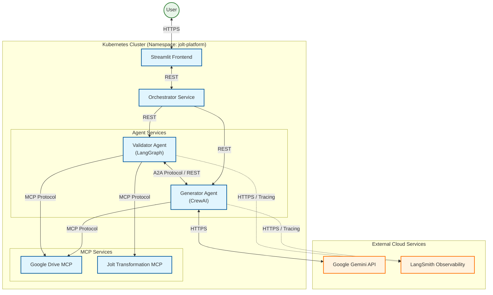
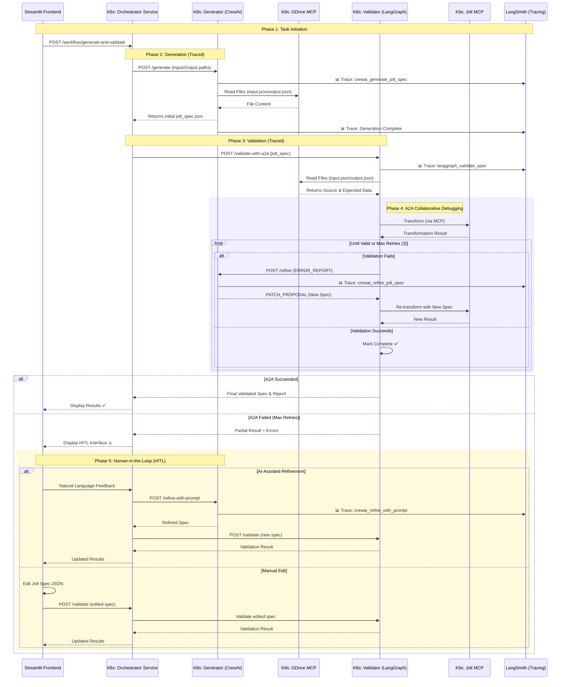
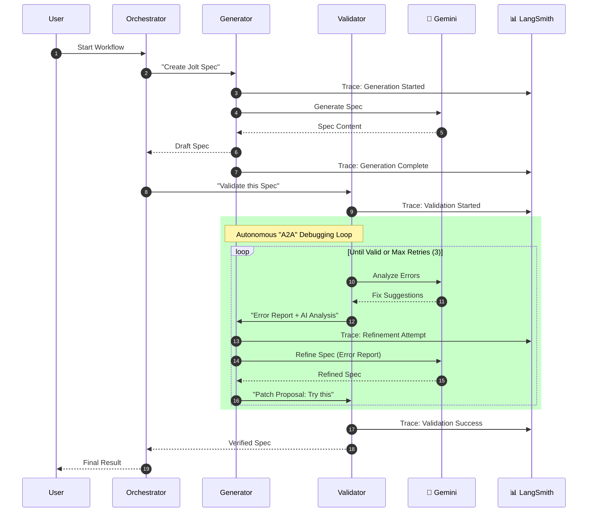
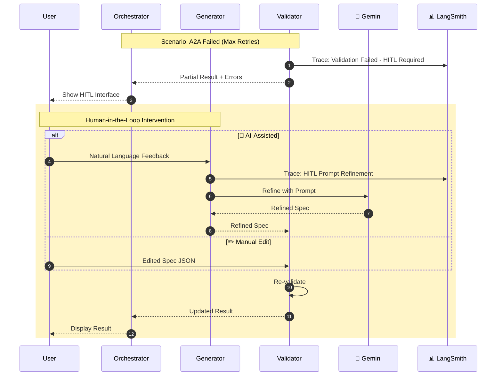

# Technical Synopsis: Heterogeneous Multi-Agent Jolt System

## 1. Executive Summary

This project demonstrates a sophisticated **heterogeneous multi-agent architecture** designed to automate the generation and validation of Jolt (JSON-to-JSON) transformation specifications. The system addresses the challenge of interoperability by integrating two distinct agentic frameworks—**CrewAI** (Generation) and **LangGraph** (Validation)—into a cohesive, secure workflow.

Critically, the entire system is deployed as **distributed microservices within a Kubernetes (K8s) environment**. This ensures that each agent operates in its own isolated container with independent dependencies, proving that agents built on entirely different stacks can collaborate effectively over a network.

### Key Features

| Feature | Description |
|---------|-------------|
| **A2A Protocol** | Agent-to-Agent Collaborative Debugging between Validator and Generator |
| **HITL Support** | Human-in-the-Loop fallback when automatic refinement exhausts retries |
| **Observability** | End-to-end tracing via LangSmith for both CrewAI and LangGraph agents |
| **MCP Integration** | Model Context Protocol for secure file access and JOLT transformations |

## 2. Distributed Microservices Architecture

The system is architected not as a monolithic application, but as a cluster of independent services running in a `jolt-platform` Kubernetes namespace. This decoupling allows for true heterogeneous environments where Python versions, dependencies, and resources are isolated per agent.

### 2.1 Kubernetes Service Topology

* **Orchestrator Service (`jolt-orchestrator-service`):**
  * **Role:** The central API gateway (FastAPI) managing Authentication (AuthN) and Authorization (AuthZ).
  * **Function:** Handles user requests and delegates initial tasks. It exposes the system to the frontend but steps back during high-frequency debugging loops.

* **Generator Service (`jolt-generator-service`):**
  * **Role:** A specialized **CrewAI** container with OpenInference instrumentation.
  * **Function:** Analyzes input/output JSON and synthesizes Jolt specifications. Supports both automatic refinement (A2A) and human-guided refinement (HITL).

* **Validator Service (`jolt-validator-service`):**
  * **Role:** A specialized **LangGraph** container with native LangChain tracing.
  * **Function:** Executes validation logic. It acts as an internal client within the cluster, sending HTTP requests directly to the Generator service during debugging sessions.

* **Google Drive MCP Service (`drive-mcp-service`):**
  * **Role:** Secure file access interface.
  * **Function:** Exposes file reading capabilities via MCP to the Generator agent, ensuring access is scoped to authorized directories.

* **Jolt MCP Service (`jolt-mcp-service`):**
  * **Role:** A dedicated Model Context Protocol server (written in Go).
  * **Function:** Provides the raw transformation engine. This service exposes `transform` tools via the MCP protocol, accessible only to authorized agents (specifically the Validator).

* **LangSmith (External):**
  * **Role:** Observability and tracing platform.
  * **Function:** Receives telemetry from all agents for monitoring, debugging, and performance analysis.

### 2.2 Heterogeneous Communication Flow

Communication occurs over the Kubernetes internal network using HTTP/REST and WebSockets. This enforces a strict contract between agents, allowing them to be written in different languages or frameworks without integration issues.

**The Workflow:**

1. **Delegation:** The Orchestrator calls the **Generator Service**.
2. **Hand-off:** The Orchestrator passes the result to the **Validator Service**.
3. **A2A Loop:** If validation fails, the **Validator** initiates a direct service-to-service call to the **Generator's** `/refine` endpoint.
4. **HITL Fallback:** If A2A exhausts retries, the user can provide natural language feedback or manually edit the spec.

## 3. Architecture & Flow Diagrams

### 3.0 High-Level System Architecture

This block diagram depicts the structural composition of the system, highlighting the relationships between internal microservices and external cloud dependencies.



### 3.1 Detailed Technical Flow (with HITL & Observability)

The following diagram illustrates the complete interaction including **Human-in-the-Loop (HITL)** fallback when automatic A2A debugging fails, and **LangSmith observability** for tracing all agent activities.



### 3.2 Simplified Logical Flows

#### 3.2.1 Autonomous A2A Flow
This diagram shows the standard success path where the agents collaborate to solve the problem without human intervention.



#### 3.2.2 Human-in-the-Loop (HITL) Flow
This diagram illustrates the fallback process when the autonomous agents cannot resolve all validation errors, requiring human guidance.



## 4. Human-in-the-Loop (HITL) Support

When the automatic A2A collaborative debugging exhausts its retry limit (default: 3 attempts), the system provides **Human-in-the-Loop** capabilities for manual intervention.

### 4.1 HITL Modes

| Mode | Description | Use Case |
|------|-------------|----------|
| **💬 AI-Assisted** | User provides natural language feedback; Generator refines spec accordingly | "Map the product.name field to product_name" |
| **✏️ Manual Edit** | User directly edits the Jolt specification JSON | Precise control over transformation rules |
| **📝 Expected Output Edit** | User modifies the expected output for re-validation | Adjusting test expectations |

### 4.2 HITL Workflow

1. **A2A Exhaustion**: Validator returns after max retries with partial result and error report
2. **User Choice**: Frontend presents HITL interface with validation errors
3. **Intervention**: User provides feedback (AI-assisted) or edits spec (manual)
4. **Re-validation**: System validates the modified spec
5. **Iteration**: Process repeats until success or user accepts result

### 4.3 API Endpoints for HITL

* `POST /refine-with-prompt` - AI-assisted refinement with natural language
* `POST /validate` - Direct validation of manually edited specs

## 5. Observability & Tracing

The system implements comprehensive observability through **LangSmith** integration, enabling end-to-end visibility into agent operations.

### 5.1 Tracing Architecture

```
┌─────────────────────────────────────────────────────────────────┐
│                       LangSmith Platform                         │
│  ┌─────────────────┐  ┌─────────────────┐  ┌─────────────────┐  │
│  │  Agent Traces   │  │   LLM Calls     │  │  Token Usage    │  │
│  └────────▲────────┘  └────────▲────────┘  └────────▲────────┘  │
└───────────┼─────────────────────┼─────────────────────┼─────────┘
            │                     │                     │
    ┌───────┴───────┐     ┌───────┴───────┐     ┌───────┴───────┐
    │  OpenInference │     │  LangChain    │     │   LiteLLM     │
    │  Instrumentation│     │  Native       │     │  Instrumentation│
    └───────▲───────┘     └───────▲───────┘     └───────▲───────┘
            │                     │                     │
    ┌───────┴───────┐     ┌───────┴───────┐     ┌───────┴───────┐
    │   Generator   │     │   Validator   │     │  Gemini LLM   │
    │   (CrewAI)    │     │  (LangGraph)  │     │    Calls      │
    └───────────────┘     └───────────────┘     └───────────────┘
```

### 5.2 Traced Operations

| Agent | Framework | Instrumentation | Traced Events |
|-------|-----------|-----------------|---------------|
| Generator | CrewAI | OpenInference | Task execution, tool calls, LLM requests |
| Validator | LangGraph | Native LangChain | State transitions, node execution, A2A messages |

### 5.3 Trace Data Captured

**CrewAI Generator Traces:**
- `crewai_generate_jolt_spec` - Initial spec generation
- `crewai_refine_jolt_spec` - A2A-triggered refinement
- `crewai_refine_jolt_spec_with_prompt` - HITL-triggered refinement
- MCP tool calls (file reads)
- LLM request/response pairs

**LangGraph Validator Traces:**
- State graph traversal
- Node execution timing
- A2A protocol messages (ERROR_REPORT, PATCH_PROPOSAL)
- Validation results and diffs

### 5.4 Enabling Tracing

```yaml
# Environment Variables (ConfigMap)
LANGCHAIN_TRACING_V2: "true"
LANGCHAIN_PROJECT: "jolt-platform"
LANGCHAIN_ENDPOINT: "https://api.smith.langchain.com"

# Secret
LANGCHAIN_API_KEY: <your-api-key>
```

## 6. Key Technical Achievements

* **Distributed Isolation:** Each agent runs in its own Kubernetes Pod. This proves that an agent built on `CrewAI` can collaborate seamlessly with an agent built on `LangGraph`, as they only share an API contract, not a runtime environment.

* **Decoupled Refinement:** The Orchestrator does not manage the retry logic; the Validator "owns" the quality assurance process, directly pinging the Generator service to fix issues.

* **Scalability:** Because they are microservices, the Generator and Validator can be scaled independently (e.g., spinning up more Generator pods for heavy workloads) without affecting the rest of the system.

* **Secure Tooling:** The Jolt MCP runs as a standalone service (`jolt-mcp-service`), adhering to the "least privilege" principle. Agents must authenticate via the Orchestrator's token system to access these tools.

* **Human-in-the-Loop:** When automatic debugging fails, users can intervene with natural language guidance or direct edits, bridging the gap between automation and human expertise.

* **End-to-End Observability:** All agent operations are traced to LangSmith, enabling debugging, performance monitoring, and audit trails across the heterogeneous system.

---

**Last Updated**: 2025-12-05  
**Version**: 2.0 (Added HITL & Observability)
