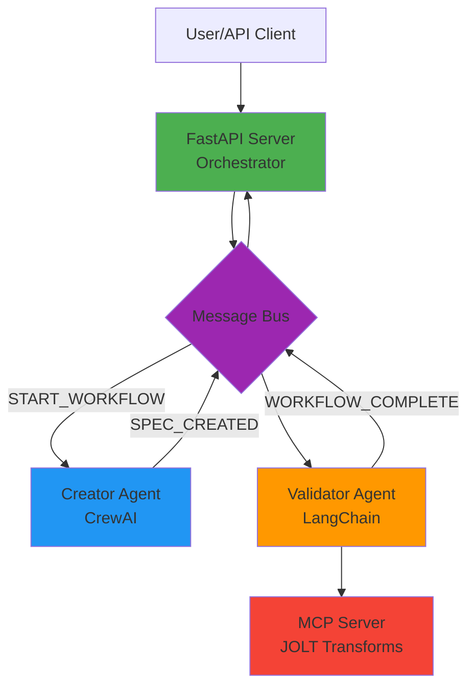

# JOLT Multi-Agent Platform Architecture

## System Overview

The JOLT Multi-Agent Platform is a production-ready, Kubernetes-native system for automated JOLT specification creation and validation using multiple AI agents.

## High-Level Architecture



## Execution Modes

### 1. Traditional Mode (Synchronous)

```
User → API → Platform.create_and_validate()
         ↓
    Creator Agent → JOLT Spec
         ↓
    Validator Agent → Validation Report
         ↓
    Response to User
```

**Characteristics**:
- Synchronous execution
- Direct method calls
- Simpler debugging
- Lower latency for single requests

### 2. A2A Mode (Event-Driven)

```
User → API → Kafka[START_WORKFLOW] → Creator Agent
                ↓                          ↓
         Job ID returned            Kafka[SPEC_CREATED]
                                           ↓
         Background Consumer ← Validator Agent
                ↓                          ↓
         Updates Job Status      Kafka[WORKFLOW_COMPLETE]
                ↓
         User polls /workflow/{job_id}
```

**Characteristics**:
- Asynchronous execution
- Event-driven messaging
- Horizontal scaling
- Fault tolerance

## Component Architecture

### 1. API Server (Orchestrator)

**File**: `jolt_platform/api_server.py`

**Responsibilities**:
- REST API endpoints
- Job management
- Message bus initialization
- Background Kafka consumer for status updates

**Key Features**:
- FastAPI framework
- Async/sync workflow support
- Job tracking with in-memory store
- Background thread for Kafka consumption

### 2. Creator Agent (CrewAI)

**File**: `agents/crewai_jolt_agent.py`

**Responsibilities**:
- Generate JOLT specifications
- Collaborate with AI models
- Publish results to message bus

**Workflow**:
1. Receive `START_WORKFLOW` message
2. Analyze input/output JSON
3. Generate JOLT spec using CrewAI
4. Publish `SPEC_CREATED` message

### 3. Validator Agent (LangChain)

**File**: `agents/langchain_validation_agent.py`

**Responsibilities**:
- Validate JOLT specifications
- Transform data via MCP server
- Compare actual vs expected output
- Generate validation reports

**Workflow**:
1. Receive `SPEC_CREATED` message
2. Call MCP server for transformation
3. Validate output against expected
4. Publish `WORKFLOW_COMPLETE` message

### 4. Message Bus

**File**: `jolt_platform/messaging.py`

**Implementations**:

#### InMemoryMessageBus
- For local development
- Synchronous callbacks
- No external dependencies

#### KafkaMessageBus
- For distributed deployment
- Asynchronous messaging
- Kafka consumer/producer
- Topic-based routing

**Factory Pattern**:
```python
def get_message_bus() -> MessageBus:
    if os.getenv("KAFKA_BOOTSTRAP_SERVERS"):
        return KafkaMessageBus(...)
    return InMemoryMessageBus()
```

### 5. MCP Server

**File**: `mcp_servers/jolt_server.py`

**Responsibilities**:
- JOLT transformations
- Tool exposure via MCP protocol
- Process isolation

**Benefits**:
- Clean separation of concerns
- Reusable across agents
- Standard protocol (MCP)

## Message Flow

### Kafka Topics

| Topic | Producer | Consumer | Purpose |
|-------|----------|----------|---------|
| `START_WORKFLOW` | Orchestrator | Creator | Initiate workflow |
| `SPEC_CREATED` | Creator | Validator | Pass JOLT spec |
| `VALIDATION_COMPLETED` | Validator | - | Intermediate result |
| `WORKFLOW_COMPLETE` | Validator | Orchestrator | Final success |
| `WORKFLOW_ERROR` | Any | Orchestrator | Error handling |

### Message Schema

#### START_WORKFLOW
```json
{
  "job_id": "uuid",
  "input_json": {...},
  "expected_output": {...}
}
```

#### SPEC_CREATED
```json
{
  "job_id": "uuid",
  "jolt_spec": [...],
  "input_json": {...},
  "expected_output": {...}
}
```

#### WORKFLOW_COMPLETE
```json
{
  "job_id": "uuid",
  "status": "success",
  "result": {
    "jolt_spec": [...],
    "validation_report": {...}
  }
}
```

## Kubernetes Architecture

### Pod Structure

```
┌─────────────────────────────────────┐
│         Kubernetes Cluster          │
│                                     │
│  ┌────────────────────────────────┐│
│  │  jolt-orchestrator (Deployment)││
│  │  - FastAPI server              ││
│  │  - Background Kafka consumer   ││
│  │  - Port 8000                   ││
│  └────────────────────────────────┘│
│                                     │
│  ┌────────────────────────────────┐│
│  │  jolt-creator (Deployment)     ││
│  │  - CrewAI agent                ││
│  │  - Kafka consumer              ││
│  │  - Scalable (replicas: N)     ││
│  └────────────────────────────────┘│
│                                     │
│  ┌────────────────────────────────┐│
│  │  jolt-validator (Deployment)   ││
│  │  - LangChain agent             ││
│  │  - MCP client                  ││
│  │  - Scalable (replicas: M)     ││
│  └────────────────────────────────┘│
│                                     │
│  ┌────────────────────────────────┐│
│  │  kafka (Deployment)            ││
│  │  - Confluent Kafka 7.5.0       ││
│  │  - Port 9092                   ││
│  └────────────────────────────────┘│
│                                     │
│  ┌────────────────────────────────┐│
│  │  zookeeper (Deployment)        ││
│  │  - Kafka coordination          ││
│  └────────────────────────────────┘│
└─────────────────────────────────────┘
```

### Scaling Strategy

**Horizontal Pod Autoscaling**:
- Creator agents: Scale based on `START_WORKFLOW` topic lag
- Validator agents: Scale based on `SPEC_CREATED` topic lag
- Orchestrator: Fixed (1 replica typically)

**Resource Allocation**:
```yaml
resources:
  requests:
    memory: "512Mi"
    cpu: "500m"
  limits:
    memory: "2Gi"
    cpu: "2000m"
```

## Data Flow

### Complete Workflow

1. **API Request**
   ```
   POST /workflow → Orchestrator
   ```

2. **Job Creation**
   ```
   Job ID generated → Stored in memory → Returned to user
   ```

3. **Workflow Initiation**
   ```
   Orchestrator → Kafka[START_WORKFLOW] → Creator
   ```

4. **Spec Creation**
   ```
   Creator → CrewAI → JOLT Spec → Kafka[SPEC_CREATED]
   ```

5. **Validation**
   ```
   Validator ← Kafka[SPEC_CREATED]
   Validator → MCP Server (transformation)
   Validator → Compare output
   Validator → Kafka[WORKFLOW_COMPLETE]
   ```

6. **Status Update**
   ```
   Orchestrator ← Kafka[WORKFLOW_COMPLETE]
   Background Consumer → Updates job status
   ```

7. **Status Query**
   ```
   GET /workflow/{job_id} → Returns result
   ```

## Design Patterns

### 1. Factory Pattern
**Usage**: Message bus creation
```python
bus = get_message_bus()  # Returns InMemory or Kafka
```

### 2. Wrapper Pattern
**Usage**: Agent abstraction
```python
class AgentWrapper:
    def __init__(self, agent, bus, name):
        self.agent = agent
        self.bus = bus
        self.setup_subscriptions()
```

### 3. Pub/Sub Pattern
**Usage**: Event-driven messaging
```python
bus.subscribe("START_WORKFLOW", handler)
bus.publish(Message(type="SPEC_CREATED", payload={...}))
```

### 4. Background Jobs Pattern
**Usage**: Async workflow execution
```python
jobs[job_id] = {"status": "running"}
background_tasks.add_task(run_workflow_async, job_id, ...)
```

## Security Considerations

### 1. API Key Management
- Stored in Kubernetes Secrets
- Never logged or exposed
- Environment variable injection

### 2. Network Policies
- Pod-to-pod communication restrictions
- Kafka access control
- API rate limiting

### 3. Data Privacy
- No persistent storage of sensitive data
- In-memory job storage (ephemeral)
- Secure Kafka communication (TLS in production)

## Fault Tolerance

### 1. Kafka Consumer Groups
- Multiple agent replicas in same consumer group
- Automatic load balancing
- Message replay on failure

### 2. Health Checks
```yaml
livenessProbe:
  httpGet:
    path: /health
    port: 8000
readinessProbe:
  httpGet:
    path: /health
    port: 8000
```

### 3. Restart Policies
```yaml
restartPolicy: Always
```

### 4. Message Retry
- Kafka message retention
- Consumer offset management
- Error topic for failed messages

## Performance Optimization

### 1. Caching
- Agent model caching
- Kafka producer pooling
- Connection re-use

### 2. Batch Processing
- Kafka message batching
- Bulk API operations

### 3. Resource Limits
- Memory limits prevent OOM
- CPU limits prevent resource starvation
- Request/limit ratios for bursting

## Monitoring & Observability

### Recommended Tools
- **Prometheus**: Metrics collection
- **Grafana**: Visualization
- **Kafka Manager**: Topic monitoring
- **K8s Dashboard**: Cluster monitoring

### Key Metrics
- Message throughput (messages/sec)
- Processing latency (ms)
- Queue depth (messages pending)
- Error rate (errors/min)
- Resource utilization (CPU/Memory)

## Future Enhancements

1. **Database Integration**: Persistent job storage (PostgreSQL/MongoDB)
2. **Authentication**: JWT-based API auth
3. **Rate Limiting**: Per-user request limits
4. **Advanced Routing**: Conditional message routing
5. **Observability**: Distributed tracing (Jaeger/Zipkin)
6. **Multi-Tenancy**: Namespace isolation
7. **GitOps**: ArgoCD/Flux deployment
8. **Service Mesh**: Istio for advanced networking

---

**Architecture Version**: 2.0 | **Last Updated**: 2025-11-25
